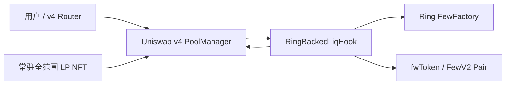
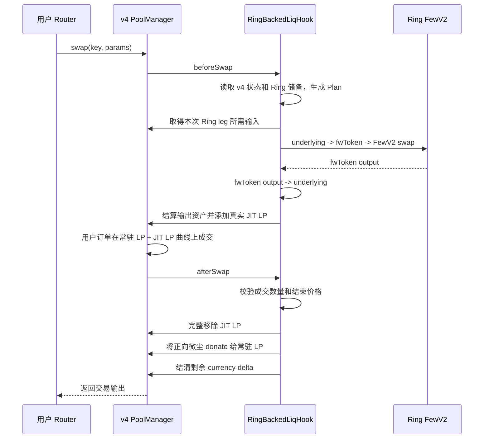

# Ring-backed JIT Liquidity 机制说明

## 1. 目标

`RingBackedLiqHook` 把 Ring Exchange 的 FewV2 流动性接入 Uniswap v4，同时保留一个可被
Uniswap 索引的常驻全范围 LP。用户仍然通过普通 v4 Router 交易；Hook 在单笔 swap 内从
Ring 获得代币、建立真实的 v4 JIT 仓位、完成成交并撤销 JIT 仓位。

这套机制解决两个问题：

- 常驻 v4 LP 让池子持续拥有可见流动性，可以被前端和路由服务发现。
- Ring Pair 提供主要成交深度，无需把相同规模的资金长期复制到 v4。

它不是预言机。Ring 报价来自 FewV2 Pair 的实时储备，仍然具有 AMM 现货价格的操纵风险；
调用方必须设置滑点和价格限制，不能把该报价用于借贷清算等预言机用途。

## 2. 流动性组成

一个 Ring-backed v4 Pool 同时包含两类流动性：

| 类型 | 存续时间 | 资金来源 | 用途 |
|---|---|---|---|
| 常驻 LP | 长期存在 | 普通 v4 LP 提供者 | 前端索引、连续报价、承接无法安全匹配 Ring 的订单 |
| JIT LP | 仅当前 swap | 当前交易输入加上从 Ring 换得的输出资产 | 将 Ring 深度映射为真实 v4 曲线流动性 |

外部 LP 只能添加全范围仓位。Hook 会拒绝窄区间外部仓位，因为窄区间流动性可能在 swap
路径中进入或退出，导致报价阶段使用的 active liquidity 与实际执行不一致。

JIT 仓位本身是围绕本次交易起始价格和结束价格构造的短期区间。它在 `beforeSwap` 添加，
在同一笔交易的 `afterSwap` 完整移除。

## 3. 组件关系



核心组件：

- `RingBackedLiqHook`：校验池和路径、生成混合成交计划、管理 JIT 生命周期。
- `RingLPPlanner`：按照 v4 数学模拟常驻 LP 与候选 JIT LP 的组合曲线。
- `FewV2Math`：按照每跳 30 bps 的 V2 公式计算 Ring 输入或输出。
- `RingLPRouter`：提供直接调用该 v4 Pool 的测试和集成入口。
- `PositionManager`：铸造由部署钱包持有的常驻全范围 LP NFT。

## 4. 报价机制

报价以 v4 当前存储价格和当前全范围 active liquidity 为起点，不直接把 Ring 的价格写入
v4。Hook 对候选 JIT liquidity 执行搜索：

1. 使用 `RingLPPlanner` 模拟“常驻 LP + 候选 JIT LP”完成用户订单后的 v4 输入、输出和结束价格。
2. 计算该 JIT 仓位净缺少的输出资产，以及撤销仓位后净返回的输入资产。
3. 读取固定 Ring 路径上各 Pair 的实时储备，用 FewV2 公式计算买到所需输出资产需要多少输入。
4. 调整 JIT liquidity，寻找 Ring 所需输入不超过 JIT 最终返回输入的最接近解。
5. 允许的正向输入余量最多为一个最小输出单位对应的输入量，再加固定的 8 raw-unit 边界。

选择不需要输入补贴的候选，是为了避免 Hook 用 owner 资金长期补贴 FewV2 手续费或价格误差。
如果找不到安全的 JIT 解，报价会退化为仅使用常驻 LP；此时 `Plan.liquidity == 0`，Ring 储备
不会被使用。

公开读取接口：

```solidity
quote(PoolKey key, bool zeroForOne, int256 amountSpecified)
    returns (uint256 ringIn, uint256 ringOut, RingLPPlanner.Plan plan);
```

- `amountSpecified < 0` 表示 exact input。
- `amountSpecified > 0` 表示 exact output。
- `ringIn/ringOut` 是 Ring 路径实际使用的数量。
- `plan.amountIn/amountOut` 是用户在整个 v4 Pool 的总成交数量。
- `plan.liquidity > 0` 表示启用 Ring JIT；等于 0 表示常驻 LP fallback。

报价是 indicative quote。Pair 储备、v4 价格或流动性变化后，执行结果可能变化或交易回滚。

## 5. 单笔交易生命周期



所有步骤在同一笔交易中原子执行。Ring swap、JIT 添加、用户成交或 JIT 移除任一步失败，整笔
交易回滚，Ring Pair 和 v4 Pool 都不会留下部分执行状态。

Hook 的 `beforeSwapReturnDelta` 和 `afterSwapReturnDelta` 权限均关闭。用户成交量由
PoolManager 的真实 LP 曲线核算，而不是通过 Hook return delta 伪造成交。

## 6. 费用与 LP 收益

- v4 Pool 的 LP fee 固定为 `0`。
- FewV2 每一跳收取固定 `30 bps`，费用已包含在 Ring 计算结果中。
- 不收取 aggregator 的额外 `5 bps` 输出费。
- v4 protocol fee 必须为 0；非零时 Hook 拒绝报价和执行。
- 常驻 LP 参与一小部分组合曲线成交，但 v4 fee 为 0，因此不会获得常规 swap fee。
- JIT 撤销后的正向取整微尘通过 `PoolManager.donate` 分配给当时活跃的常驻全范围 LP。

因此，常驻 LP 的额外收益目前主要来自可安全捐赠的微尘，而不是固定费率收入。

## 7. Rounding reserve

Hook 为两种底层资产各维护一个很小的 owner-funded rounding reserve：

- 启用池前，每种资产至少需要 `16` 个 raw units。
- 每笔成功交易每种资产的实际负向损失最多为 `8` 个 raw units。
- 超过限制会回滚，不会静默消耗更多 owner 资金。
- reserve 只处理整数数学边界，不是交易库存或主要流动性来源。

正向输入余量受到动态 input quantum 限制，并捐赠给常驻 LP；它不会记为 owner reserve 收益。

## 8. 初始化与安全边界

每个 Hook 实例只服务一个固定 Pool，并在初始化时锁定：

- 两个 ERC-20 底层资产；不直接支持 native ETH，前端使用 WETH 包装/解包。
- `fee == 0`、合法的 `tickSpacing` 和 Hook 地址。
- 2 至 4 个不重复的 canonical fwToken 路径。
- 每一跳已存在的 FewV2 Pair 及其 token 顺序。

其他保护包括：

- owner-gated 初始化、暂停、恢复和 rounding reserve 管理。
- 禁止放弃 ownership，确保出现异常时仍可暂停。
- transient JIT lock 和 transient reentrancy guard。
- 执行后校验总输入、总输出、结束价格、Hook 余额和 PoolManager delta。
- fee-on-transfer 和 rebasing token 不受支持，余额变化不精确时交易回滚。
- 超大数量、无法表示的价格、越过用户价格限制和无常驻流动性都会回滚。

Ring Pair 使用实时储备，因此仍应考虑抢跑、夹子交易和储备操纵。用户或上层 Router 必须设置
合理的 `amountOutMinimum`、`amountInMaximum`、deadline 和 `sqrtPriceLimitX96`。

## 9. 前端与索引

常驻 LP 通过官方 v4 PositionManager 铸造 NFT，所以 Uniswap Positions 页面和路由服务可以
发现这个 Pool。索引存在延迟；链上 `live == true` 和 `quote()` 正常并不保证新池会立即出现在
前端。

前端展示的总报价可能略优于直接 Ring 报价，因为少量订单会在零费率常驻 LP 上成交，其余
部分使用 Ring JIT。例如 10,000 RHT 的总输入可能被拆成约 9,873 RHT 的 Ring leg 和约
127 RHT 的常驻 LP leg，具体比例取决于实时储备和 v4 状态。

## 10. Sepolia 一键部署

复制环境文件并填写 RPC 与部署私钥：

```bash
cp .env.ring-backed-sepolia.example .env.ring-backed-sepolia
bash scripts/ring-backed/sepolia.sh deploy-all
```

默认测试配置会完成：

- 部署固定发行 10 亿枚的 RHT。
- 向 Ring Pair 添加 `1 WETH + 1,000,000 RHT`。
- 部署 Factory、Hook 和 `RingLPRouter`。
- 初始化零费率 v4 Pool。
- 添加 `0.01 WETH + 10,000 RHT` 的常驻全范围 LP。
- 启用 Pool 并检查 `live()`。
- 将生成的地址、路径和 Position NFT ID 回写到 `.env.ring-backed-sepolia`。

部署脚本的分步子命令仍可用于故障定位。`deploy-all` 不支持 `SIMULATE=true`，因为后续阶段
依赖前一阶段已经广播到链上的合约。

## 11. 当前限制

- 一个 Hook 实例只绑定一个 v4 Pool 和一条 Ring 路径。
- Ring 路径最多三跳，每跳均为 30 bps。
- 只支持标准 ERC-20 底层资产和 canonical FewToken。
- 只允许外部全范围 v4 LP。
- Ring 报价不是抗操纵预言机价格。
- Uniswap 官方路由和索引属于链下服务，新部署可能暂时无法自动发现。
- 当前实现尚未针对生产环境完成独立安全审计。

## 12. 相关代码

- `src/hooks/RingBackedLiqHook.sol`
- `src/libraries/RingLPPlanner.sol`
- `src/libraries/FewV2Math.sol`
- `src/routers/RingLPRouter.sol`
- `test/RingBackedLiqHook.t.sol`
- `scripts/ring-backed/sepolia.sh`
